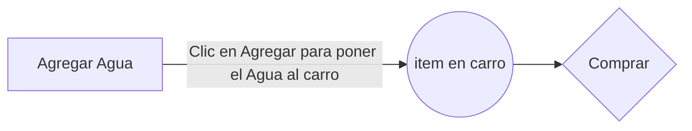

# Taller 3

En este taller se creó una página a forma de galería de productos para que un usuario pueda elegir si agregar o eliminar elementos de un carrito de productos y finalmente recibir un mensaje vía Whatsapp a forma de recibo dando la cantidad a pagar en efectivo.

## Integrantes

- Juan Andrés Gaviria
- Juan José Areiza Orrego
- David García Sánchez

## Productos de la Página

A continuación se puede ver la totalidad de productos ofertados por el hotel:

|       Producto |Precio|
|----------------|-----------------------------|
|Agua Manantial 600ml |$ 2.900             |
|Chocolatina Jet personal|$ 1.000            |
|Cerveza Corona 210ml|$ 2.950|
|Toalla personal|$ 9.900|
|Cepillo de dientes|$ 3.500|
|Jabón barra corporal 125gr|$ 2.500|
|Shampoo Dove 750ml|$ 24.900|
|Protector Solar Nivea 125ml|$ 57.200|
|Gafas de sol|$ 42.600|
|Sombrero de playa|$ 65.000|

## Diagrama UML de Botón Agregar

Procedimiento de funcionamiento principal de la página:

